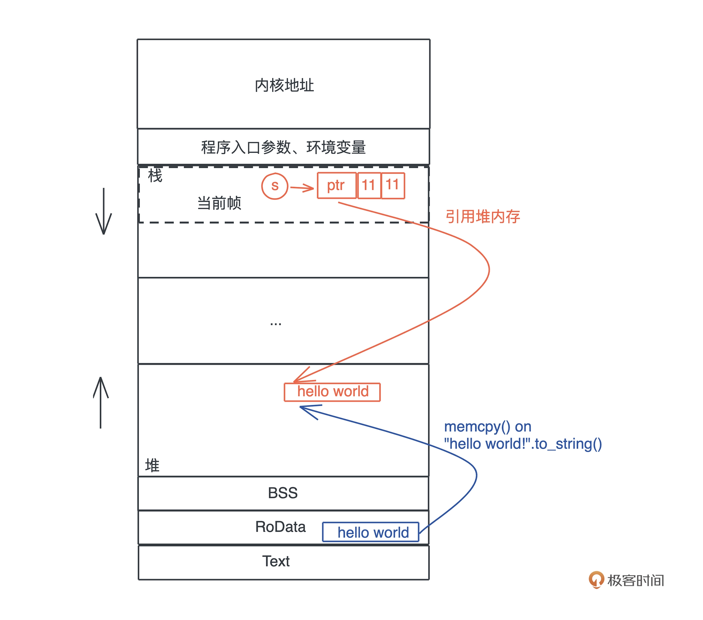

# 01｜内存：值放堆上还是放栈上，这是一个问题

## 总结

栈上存放的数据是静态的，固定大小，固定生命周期；堆上存放的数据是动态的，不固定大小，不固定生命周期。

## 内存

以该段代码为例
```Rust
let s = "hello world".to_string();
```

hello world作为字符串常量（string literal），编译时被存入执行文件的 .RODATA 段（GCC），在程序加载时，获得一个固定的内存地址。

当执行 “hello world”.to_string() 时，堆上一块新的内存被分配出来，并把 “hello world” 逐个字节拷贝过去。

当把堆上的数据赋值给 s 时，s 作为分配在栈上的一个变量，它需要知道堆上内存的地址，长度以及它现在有多大。

最终，为了表述这个字符串，我们使用了三个 word：第一个表示指针、第二个表示字符串的当前长度（11）、第三个表示这片内存的总容量（11）



## 栈

### 栈
每当一个函数被调用时，一块连续的内存就会在栈顶被分配出来，这块内存被称为帧（frame）。

在调用的过程中，一个新的帧会分配足够的空间存储寄存器的上下文。在函数里使用到的通用寄存器会在栈保存一个副本，当这个函数调用结束，通过副本，可以恢复出原本的寄存器的上下文。此外，函数所需要使用到的局部变量，也都会在帧分配的时候被预留出来。


那一个函数运行时，怎么确定究竟需要多大的帧呢？

这要归功于编译器。在编译并优化代码的时候，一个函数就是一个最小的编译单元。在这个函数里，编译器得知道要用到哪些寄存器、栈上要放哪些局部变量，而这些都要在编译时确定。所以编译器就需要明确每个局部变量的大小，以便于预留空间。

因此，**在编译时，一切无法确定大小或者大小可以改变的数据，都无法安全地放在栈上，最好放在堆上。**

### 数据放栈上的问题

栈上的内存分配是非常高效的。只需要改动栈指针（stack pointer），就可以预留相应的空间；把栈指针改动回来，预留的空间又会被释放掉。预留和释放只是动动寄存器，不涉及额外计算、不涉及系统调用，因而效率很高。

但是，在实际工作中，我们又要**避免**把大量的数据分配在栈上

这主要是考虑到调用栈的大小，**避免栈溢出（stack overflow）**

## 堆

### 堆
栈上的内存在函数调用结束之后，所使用的帧被回收，相关变量对应的内存也都被回收待用。所以栈上内存的生命周期是不受开发者控制的，并且局限在当前调用栈。

而堆上分配出来的每一块内存需要显式地释放，这就使堆上内存有更加灵活的生命周期，可以在不同的调用栈之间共享数据。

因此，**除了动态大小的内存需要被分配到堆上外，动态生命周期的内存也需要分配到堆上。**

### 放堆上的问题

**内存泄露问题**

1. 追踪式垃圾回收（Tracing GC）：定期标记（mark）找出不再被引用的对象，然后将其清理（sweep）掉，来自动管理内存，减轻开发者的负担。如Java、Golang

2. 自动引用计数（Automatic Reference Counting）：在编译时，它为每个函数插入 retain/release 语句来自动维护堆上对象的引用计数，当引用计数为零的时候，release 语句就释放对象。如ObjC、Swift

从效率上来说，GC 在内存分配和释放上无需额外操作，而 ARC 添加了大量的额外代码处理引用计数，所以 GC 效率更高，吞吐量（throughput）更大。但是，GC 释放内存的时机是不确定的，释放时引发的 STW（Stop The World），也会导致代码执行的延迟（latency）不确定。所以一般携带 GC 的编程语言，不适于做嵌入式系统或者实时系统。


